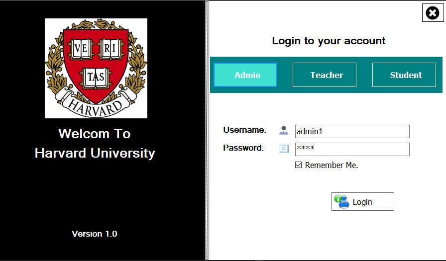
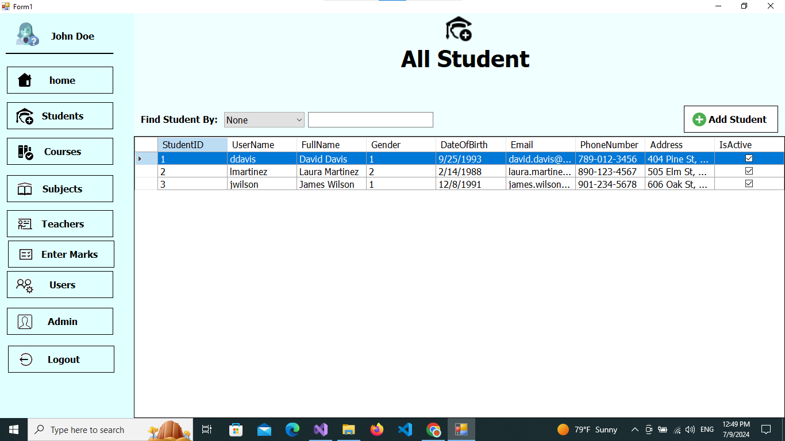
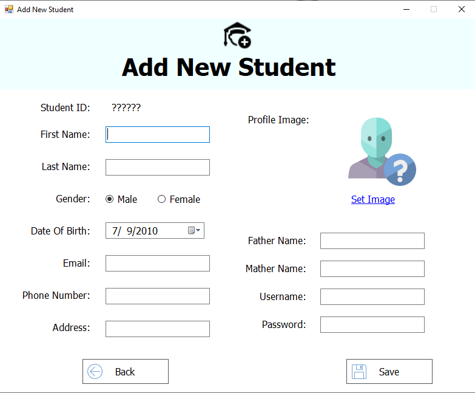

# College Management System In C# .Net Framework
## Hi there 👋!
Here I have designed and developed College management system. The Technology I have used is C# with .Net Framework, and database i have used is SQL server and I use Visual Studio 2022 IDE. This design is purely coded myself no copied content.

# Features

- **Common Features**
  - Students Management
  - Courses Management
  - Subjects Management
  - Thechers Management
  - Student Marks Management
  - Admins Management
  - Users Management
 
# Installation
  - Clone and Import this project into your IDE
  - Download the Database from  'Database folder' and restore it to your SQL Server.
    
# Database Connection

- change the connection string from:
  - CMSDataLayer/clsDataAccessSettings.cs/
    
# User Credentials

**Admin**
- Username: admin1
- Password: 1234

**Teachers**
- Username: ejohnson
- Password: Pass123

**Students**
- Username: lmartinez
- Password: Pass456

# Demo

### right click to a specific row to update or delete or add

